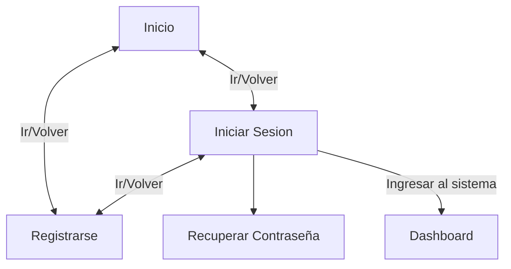
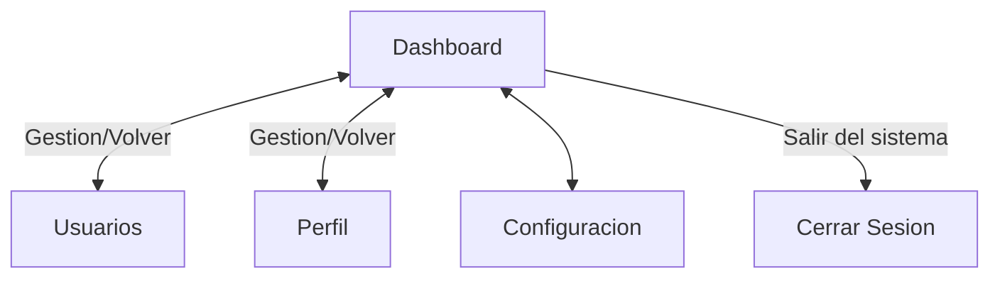
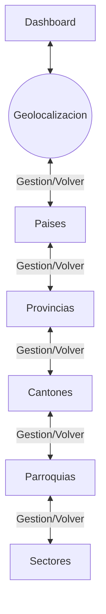
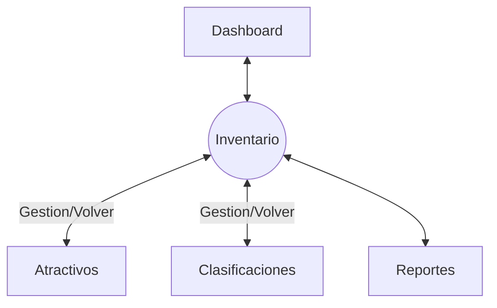
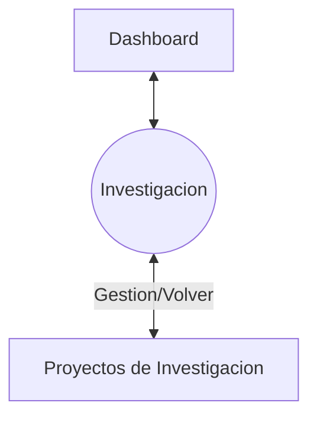
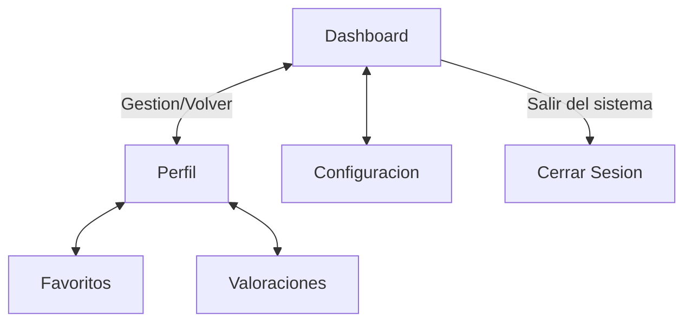
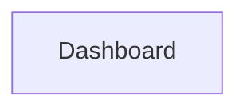
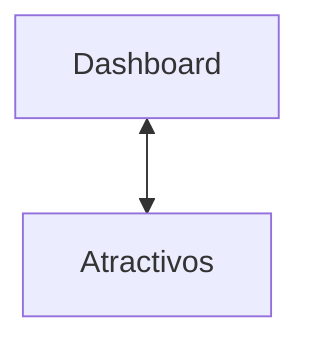
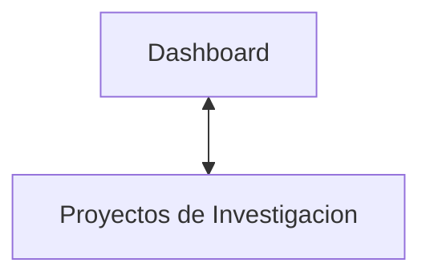

# Flujo de Navegacion

## Parte Publica

## Parte Privada

### Usuarios Administrativos 
>  - Administradores 
>  - Gestores Territoriales 
>  - Gestores Turisticos
>  - Investigadores
---
#### Modulo de Usuarios

---
#### Modulo de Geolocalizacion

---
#### Modulo de Atractivos e Inventario

---
#### Modulo de Investigacion

---
### Usuarios Generales 
> - Turistas
---
#### Modulo de Usuarios

---
#### Modulo de Geolocalizacion

---
#### Modulo de Atractivos e Inventario

---
#### Modulo de Investigacion

---